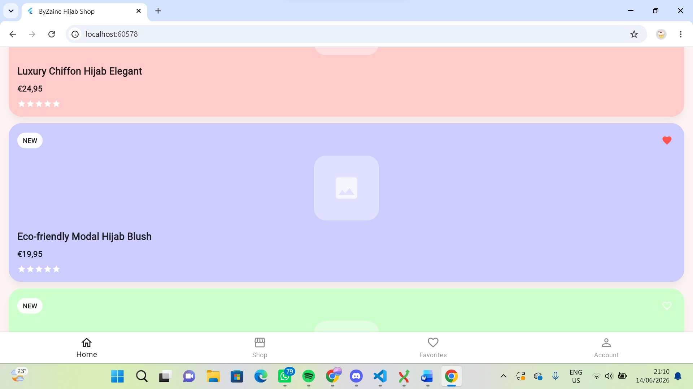
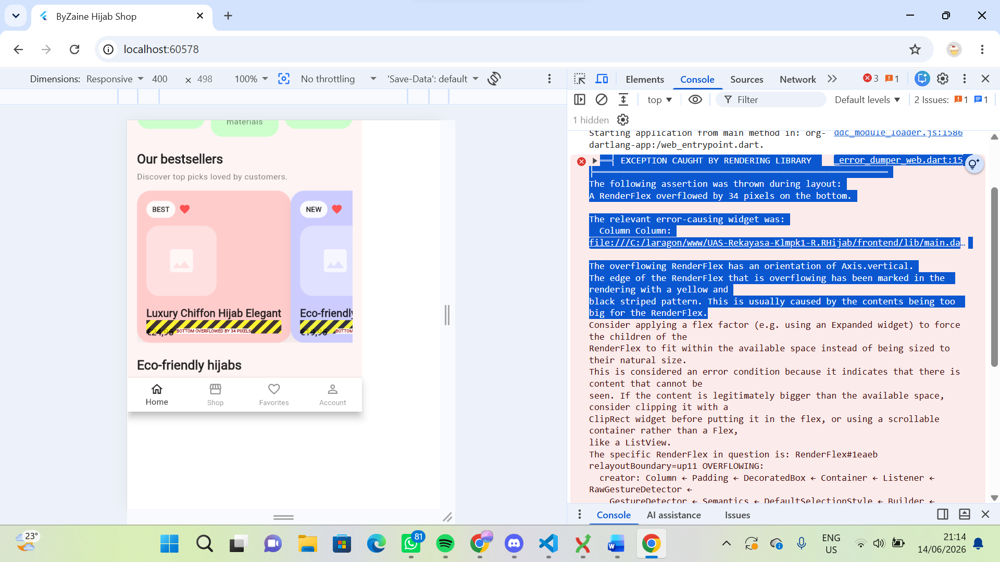

di dalam gambar ini saya menemukan temuan berupa kartu tampilan katalog produk terlalu besar dan butuh penyesuaian 

══╡ EXCEPTION CAUGHT BY RENDERING LIBRARY ╞═════════════════════════════════════════════════════════
The following assertion was thrown during layout:
A RenderFlex overflowed by 34 pixels on the bottom.

The relevant error-causing widget was:
  Column Column:file:///C:/laragon/www/UAS-Rekayasa-Klmpk1-R.RHijab/frontend/lib/main.dart:1021:16

The overflowing RenderFlex has an orientation of Axis.vertical.
The edge of the RenderFlex that is overflowing has been marked in the rendering with a yellow and
black striped pattern. This is usually caused by the contents being too big for the RenderFlex.
Consider applying a flex factor (e.g. using an Expanded widget) to force the children of the
RenderFlex to fit within the available space instead of being sized to their natural size.
This is considered an error condition because it indicates that there is content that cannot be
seen. If the content is legitimately bigger than the available space, consider clipping it with a
ClipRect widget before putting it in the flex, or using a scrollable container rather than a Flex,
like a ListView.
The specific RenderFlex in question is: RenderFlex#1eaeb relayoutBoundary=up11 OVERFLOWING:
  creator: Column ← Padding ← DecoratedBox ← Container ← Listener ← RawGestureDetector ←
    GestureDetector ← Semantics ← DefaultSelectionStyle ← Builder ← MouseRegion ← Semantics ← ⋯
  parentData: offset=Offset(16.0, 16.0) (can use size)
  constraints: BoxConstraints(0.0<=w<=Infinity, h=228.0)
  size: Size(230.3, 228.0)
  direction: vertical
  mainAxisAlignment: start
  mainAxisSize: max
  crossAxisAlignment: start
  textDirection: ltr
  verticalDirection: down
  spacing: 0.0
◢◤◢◤◢◤◢◤◢◤◢◤◢◤◢◤◢◤◢◤◢◤◢◤◢◤◢◤◢◤◢◤◢◤◢◤◢◤◢◤◢◤◢◤◢◤◢◤◢◤◢◤◢◤◢◤◢◤◢◤◢◤◢◤◢◤◢◤◢◤◢◤◢◤◢◤◢◤◢◤◢◤◢◤◢◤◢◤◢◤◢◤◢◤◢◤◢◤◢◤
════════════════════════════════════════════════════════════════════════════════════════════════════
dump @ _error_dumper_web.dart:15
dumpErrorToConsole @ assertions.dart:1026
(anonymous) @ operations.dart:118
reportError @ assertions.dart:1193
(anonymous) @ debug_overflow_indicator.dart:259
paintOverflowIndicator @ debug_overflow_indicator.dart:329
(anonymous) @ flex.dart:1449
paint @ flex.dart:1456
(anonymous) @ object.dart:3568
paintChild @ object.dart:265
paint @ shifted_box.dart:98
(anonymous) @ object.dart:3568
paintChild @ object.dart:265
paint @ proxy_box.dart:143
paint @ proxy_box.dart:2512
(anonymous) @ object.dart:3568
paintChild @ object.dart:265
paint @ proxy_box.dart:143
(anonymous) @ object.dart:3568
paintChild @ object.dart:265
paint @ proxy_box.dart:143
(anonymous) @ object.dart:3568
paintChild @ object.dart:265
paint @ proxy_box.dart:143
(anonymous) @ object.dart:3568
paintChild @ object.dart:265
paint @ proxy_box.dart:143
(anonymous) @ object.dart:3568
paintChild @ object.dart:265
paint @ proxy_box.dart:143
(anonymous) @ object.dart:3568
_repaintCompositedChild @ object.dart:180
repaintCompositedChild @ object.dart:125
(anonymous) @ object.dart:276
paintChild @ object.dart:257
paint @ proxy_box.dart:143
(anonymous) @ object.dart:3568
paintChild @ object.dart:265
paint @ sliver_multi_box_adaptor.dart:742
(anonymous) @ object.dart:3568
paintChild @ object.dart:265
paint @ sliver_padding.dart:270
(anonymous) @ object.dart:3568
paintChild @ object.dart:265
(anonymous) @ viewport.dart:999
paint @ viewport.dart:984
(anonymous) @ object.dart:3568
_repaintCompositedChild @ object.dart:180
repaintCompositedChild @ object.dart:125
(anonymous) @ object.dart:276
paintChild @ object.dart:257
paint @ proxy_box.dart:143
(anonymous) @ object.dart:3568
paintChild @ object.dart:265
paint @ proxy_box.dart:143
(anonymous) @ object.dart:3568
paintChild @ object.dart:265
paint @ proxy_box.dart:143
(anonymous) @ object.dart:3568
paintChild @ object.dart:265
paint @ proxy_box.dart:143
(anonymous) @ object.dart:3568
paintChild @ object.dart:265
paint @ proxy_box.dart:143
(anonymous) @ object.dart:3568
paintChild @ object.dart:265
paint @ proxy_box.dart:143
(anonymous) @ object.dart:3568
paintChild @ object.dart:265
paint @ proxy_box.dart:143
(anonymous) @ object.dart:3568
paintChild @ object.dart:265
defaultPaint @ box.dart:3368
paint @ flex.dart:1402
(anonymous) @ object.dart:3568
paintChild @ object.dart:265
paint @ shifted_box.dart:98
(anonymous) @ object.dart:3568
paintChild @ object.dart:265
(anonymous) @ single_child_scroll_view.dart:550
pushLayer @ object.dart:522
pushClipRect @ object.dart:589
paint @ single_child_scroll_view.dart:554
(anonymous) @ object.dart:3568
_repaintCompositedChild @ object.dart:180
repaintCompositedChild @ object.dart:125
(anonymous) @ object.dart:276
paintChild @ object.dart:257
paint @ proxy_box.dart:143
(anonymous) @ object.dart:3568
paintChild @ object.dart:265
paint @ proxy_box.dart:143
(anonymous) @ object.dart:3568
paintChild @ object.dart:265
paint @ proxy_box.dart:143
(anonymous) @ object.dart:3568
paintChild @ object.dart:265
paint @ proxy_box.dart:143
(anonymous) @ object.dart:3568
paintChild @ object.dart:265
paint @ proxy_box.dart:143
(anonymous) @ object.dart:3568
paintChild @ object.dart:265
paint @ proxy_box.dart:143
(anonymous) @ object.dart:3568
paintChild @ object.dart:265
paint @ proxy_box.dart:143
(anonymous) @ object.dart:3568
_repaintCompositedChild @ object.dart:180
repaintCompositedChild @ object.dart:125
(anonymous) @ object.dart:276
paintChild @ object.dart:257
paint @ proxy_box.dart:143
paint @ custom_paint.dart:644
(anonymous) @ object.dart:3568
paintChild @ object.dart:265
paint @ proxy_box.dart:143
(anonymous) @ object.dart:3568
paintChild @ object.dart:265
paint @ proxy_box.dart:143
(anonymous) @ object.dart:3568
paintChild @ object.dart:265
paint @ proxy_box.dart:143
(anonymous) @ object.dart:3568
paintChild @ object.dart:265
paint @ proxy_box.dart:143
(anonymous) @ object.dart:3568
paintChild @ object.dart:265
paint @ proxy_box.dart:143
(anonymous) @ object.dart:3568
_repaintCompositedChild @ object.dart:180
repaintCompositedChild @ object.dart:125
(anonymous) @ object.dart:276
paintChild @ object.dart:257
paint @ shifted_box.dart:98
(anonymous) @ object.dart:3568
paintChild @ object.dart:265
defaultPaint @ box.dart:3368
paint @ custom_layout.dart:422
(anonymous) @ object.dart:3568
paintChild @ object.dart:265
paint @ proxy_box.dart:143
paint @ material.dart:634
(anonymous) @ object.dart:3568
paintChild @ object.dart:265
paint @ proxy_box.dart:143
(anonymous) @ proxy_box.dart:2252
pushClipRRect @ object.dart:626
paint @ proxy_box.dart:2239
(anonymous) @ object.dart:3568
paintChild @ object.dart:265
paint @ proxy_box.dart:143
(anonymous) @ object.dart:3568
paintChild @ object.dart:265
paint @ proxy_box.dart:143
(anonymous) @ object.dart:3568
_repaintCompositedChild @ object.dart:180
repaintCompositedChild @ object.dart:125
(anonymous) @ object.dart:276
paintChild @ object.dart:257
paint @ proxy_box.dart:143
(anonymous) @ object.dart:3568
paintChild @ object.dart:265
paint @ proxy_box.dart:143
(anonymous) @ operations.dart:173
paint @ page_transitions_theme.dart:1129
paint @ snapshot_widget.dart:337
(anonymous) @ object.dart:3568
paintChild @ object.dart:265
paint @ proxy_box.dart:143
(anonymous) @ operations.dart:173
paint @ page_transitions_theme.dart:1034
paint @ snapshot_widget.dart:337
(anonymous) @ object.dart:3568
paintChild @ object.dart:265
paint @ proxy_box.dart:143
(anonymous) @ operations.dart:173
paint @ page_transitions_theme.dart:1129
paint @ snapshot_widget.dart:337
(anonymous) @ object.dart:3568
paintChild @ object.dart:265
paint @ proxy_box.dart:143
(anonymous) @ operations.dart:173
paint @ page_transitions_theme.dart:1034
paint @ snapshot_widget.dart:337
(anonymous) @ object.dart:3568
paintChild @ object.dart:265
paint @ proxy_box.dart:143
(anonymous) @ object.dart:3568
_repaintCompositedChild @ object.dart:180
repaintCompositedChild @ object.dart:125
(anonymous) @ object.dart:276
paintChild @ object.dart:257
paint @ proxy_box.dart:143
(anonymous) @ object.dart:3568
paintChild @ object.dart:265
paint @ proxy_box.dart:143
paint @ proxy_box.dart:3943
(anonymous) @ object.dart:3568
paintChild @ object.dart:265
setTimeout
hasTimer @ isolate_helper.dart:54
(anonymous) @ async_patch.dart:194
createTimer @ zone.dart:986
(anonymous) @ timer.dart:46
run @ timer.dart:107
scheduleWarmUpFrame @ frame_service.dart:160
scheduleWarmUpFrame @ platform_dispatcher.dart:704
scheduleWarmUpFrame @ binding.dart:1048
(anonymous) @ binding.dart:1950
_runWidget @ binding.dart:1950
runApp @ binding.dart:1885
main$ @ main.dart:5
(anonymous) @ operations.dart:118
(anonymous) @ web_entrypoint.dart:24
(anonymous) @ initialization.dart:39
(anonymous) @ async_patch.dart:618
(anonymous) @ async_patch.dart:643
(anonymous) @ async_patch.dart:589
runUnary @ zone.dart:962
handleValue @ future_impl.dart:222
handleValueCallback @ future_impl.dart:948
_propagateToListeners @ future_impl.dart:977
(anonymous) @ future_impl.dart:720
(anonymous) @ future_impl.dart:804
(anonymous) @ schedule_microtask.dart:40
_startMicrotaskLoop @ schedule_microtask.dart:49
(anonymous) @ operations.dart:118
(anonymous) @ async_patch.dart:183
Promise.then
_scheduleImmediateWithPromise @ async_patch.dart:182
_scheduleImmediate @ async_patch.dart:155
_scheduleAsyncCallback @ schedule_microtask.dart:70
_rootScheduleMicrotask @ zone_root.dart:133
scheduleMicrotask @ zone.dart:982
(anonymous) @ future_impl.dart:803
(anonymous) @ future_impl.dart:763
(anonymous) @ future_impl.dart:359
value @ future.dart:372
(anonymous) @ window.dart:622
implicit @ window.dart:62
(anonymous) @ window.dart:699
(anonymous) @ initialization.dart:187
(anonymous) @ async_patch.dart:618
(anonymous) @ async_patch.dart:643
_asyncStartSync @ async_patch.dart:537
initializeEngineUi @ initialization.dart:165
(anonymous) @ initialization.dart:37
(anonymous) @ async_patch.dart:618
(anonymous) @ async_patch.dart:643
_asyncStartSync @ async_patch.dart:537
(anonymous) @ initialization.dart:39
(anonymous) @ app_bootstrap.dart:59
(anonymous) @ async_patch.dart:618
(anonymous) @ async_patch.dart:643
_asyncStartSync @ async_patch.dart:537
(anonymous) @ app_bootstrap.dart:60
(anonymous) @ js_loader.dart:72
_callDartFunctionFast1 @ js_allow_interop_patch.dart:222
(anonymous) @ js_allow_interop_patch.dart:78
(anonymous) @ flutter_bootstrap.js:1
Promise.then
a @ flutter_bootstrap.js:1
didCreateEngineInitializer @ flutter_bootstrap.js:1
(anonymous) @ initialization.dart:50
(anonymous) @ async_patch.dart:618
(anonymous) @ async_patch.dart:643
_asyncStartSync @ async_patch.dart:537
(anonymous) @ initialization.dart:27
(anonymous) @ web_entrypoint.dart:19
(anonymous) @ async_patch.dart:618
(anonymous) @ async_patch.dart:643
_asyncStartSync @ async_patch.dart:537
(anonymous) @ web_entrypoint.dart:18
runMainAndHandleErrors @ ddc_module_loader.js:1557
_runMain @ ddc_module_loader.js:1579
runMain @ ddc_module_loader.js:1593
runMain @ ddc_module_loader.js:2140
child.main @ main_module.bootstrap.js:25
(anonymous) @ main_module.bootstrap.js:33
window.$dartRunMain @ main_module.bootstrap.js:32
(anonymous) @ (unknown)
runMain @ client.js:10436
(anonymous) @ client.js:26985
(anonymous) @ client.js:3893
call$2 @ client.js:13631
_asyncStartSync @ client.js:3857
$call$body$main__closure @ client.js:27054
call$1 @ client.js:26892
_rootRunUnary @ client.js:4391
runUnary$2$2 @ client.js:15254
runUnaryGuarded$1$2 @ client.js:15201
_sendData$1 @ client.js:14739
_add$1 @ client.js:14684
_add$1 @ client.js:15080
_handleData$2 @ client.js:15140
_handleData$1 @ client.js:15106
(anonymous) @ client.js:1637
_rootRunUnary @ client.js:4391
runUnary$2$2 @ client.js:15254
runUnaryGuarded$1$2 @ client.js:15201
__internal$_onData$1 @ client.js:11639
(anonymous) @ client.js:1637
_rootRunUnary @ client.js:4391
runUnary$2$2 @ client.js:15254
runUnaryGuarded$1$2 @ client.js:15201
_sendData$1 @ client.js:14739
perform$1 @ client.js:14914
call$0 @ client.js:14973
_rootRun @ client.js:4372
run$1$1 @ client.js:15246
runGuarded$1 @ client.js:15189
call$0 @ client.js:15378
_rootRun @ client.js:4376
run$1$1 @ client.js:15246
runGuarded$1 @ client.js:15189
call$0 @ client.js:15378
_microtaskLoop @ client.js:4220
_startMicrotaskLoop @ client.js:4226
call$1 @ client.js:13509
PendingScript
runMain @ client.js:10436
(anonymous) @ client.js:26985
(anonymous) @ client.js:3893
call$2 @ client.js:13631
_asyncStartSync @ client.js:3857
$call$body$main__closure @ client.js:27054
call$1 @ client.js:26892
_rootRunUnary @ client.js:4391
runUnary$2$2 @ client.js:15254
runUnaryGuarded$1$2 @ client.js:15201
_sendData$1 @ client.js:14739
_add$1 @ client.js:14684
_add$1 @ client.js:15080
_handleData$2 @ client.js:15140
_handleData$1 @ client.js:15106
(anonymous) @ client.js:1637
_rootRunUnary @ client.js:4391
runUnary$2$2 @ client.js:15254
runUnaryGuarded$1$2 @ client.js:15201
__internal$_onData$1 @ client.js:11639
(anonymous) @ client.js:1637
_rootRunUnary @ client.js:4391
runUnary$2$2 @ client.js:15254
runUnaryGuarded$1$2 @ client.js:15201
_sendData$1 @ client.js:14739
perform$1 @ client.js:14914
call$0 @ client.js:14973
_rootRun @ client.js:4372
run$1$1 @ client.js:15246
runGuarded$1 @ client.js:15189
call$0 @ client.js:15378
_rootRun @ client.js:4376
run$1$1 @ client.js:15246
runGuarded$1 @ client.js:15189
call$0 @ client.js:15378
_microtaskLoop @ client.js:4220
_startMicrotaskLoop @ client.js:4226
call$1 @ client.js:13509
childList
call$1 @ client.js:13519
_scheduleAsyncCallback @ client.js:4240
_rootScheduleMicrotask @ client.js:4442
scheduleMicrotask$1 @ client.js:15298
scheduleMicrotask @ client.js:4281
schedule$1 @ client.js:14945
_addPending$1 @ client.js:14730
_sendData$1 @ client.js:14515
_add$1 @ client.js:14408
add$1 @ client.js:14373
call$1 @ client.js:26576
call$1 @ client.js:26522
_rootRunUnary @ client.js:4395
runUnary$2$2 @ client.js:15254
runUnaryGuarded$1$2 @ client.js:15201
call$1 @ client.js:15385
_callDartFunctionFast1 @ client.js:7834
(anonymous) @ client.js:7810
2_error_dumper_web.dart:15 Another exception was thrown: A RenderFlex overflowed by 34 pixels on the bottom.
dump @ _error_dumper_web.dart:15
dumpErrorToConsole @ assertions.dart:1040
(anonymous) @ operations.dart:118
reportError @ assertions.dart:1193
(anonymous) @ debug_overflow_indicator.dart:259
paintOverflowIndicator @ debug_overflow_indicator.dart:329
(anonymous) @ flex.dart:1449
paint @ flex.dart:1456
(anonymous) @ object.dart:3568
paintChild @ object.dart:265
paint @ shifted_box.dart:98
(anonymous) @ object.dart:3568
paintChild @ object.dart:265
paint @ proxy_box.dart:143
paint @ proxy_box.dart:2512
(anonymous) @ object.dart:3568
paintChild @ object.dart:265
paint @ proxy_box.dart:143
(anonymous) @ object.dart:3568
paintChild @ object.dart:265
paint @ proxy_box.dart:143
(anonymous) @ object.dart:3568
paintChild @ object.dart:265
paint @ proxy_box.dart:143
(anonymous) @ object.dart:3568
paintChild @ object.dart:265
paint @ proxy_box.dart:143
(anonymous) @ object.dart:3568
paintChild @ object.dart:265
paint @ proxy_box.dart:143
(anonymous) @ object.dart:3568
_repaintCompositedChild @ object.dart:180
repaintCompositedChild @ object.dart:125
(anonymous) @ object.dart:276
paintChild @ object.dart:257
paint @ proxy_box.dart:143
(anonymous) @ object.dart:3568
paintChild @ object.dart:265
paint @ sliver_multi_box_adaptor.dart:742
(anonymous) @ object.dart:3568
paintChild @ object.dart:265
paint @ sliver_padding.dart:270
(anonymous) @ object.dart:3568
paintChild @ object.dart:265
(anonymous) @ viewport.dart:999
paint @ viewport.dart:984
(anonymous) @ object.dart:3568
_repaintCompositedChild @ object.dart:180
repaintCompositedChild @ object.dart:125
(anonymous) @ object.dart:276
paintChild @ object.dart:257
paint @ proxy_box.dart:143
(anonymous) @ object.dart:3568
paintChild @ object.dart:265
paint @ proxy_box.dart:143
(anonymous) @ object.dart:3568
paintChild @ object.dart:265
paint @ proxy_box.dart:143
(anonymous) @ object.dart:3568
paintChild @ object.dart:265
paint @ proxy_box.dart:143
(anonymous) @ object.dart:3568
paintChild @ object.dart:265
paint @ proxy_box.dart:143
(anonymous) @ object.dart:3568
paintChild @ object.dart:265
paint @ proxy_box.dart:143
(anonymous) @ object.dart:3568
paintChild @ object.dart:265
paint @ proxy_box.dart:143
(anonymous) @ object.dart:3568
paintChild @ object.dart:265
defaultPaint @ box.dart:3368
paint @ flex.dart:1402
(anonymous) @ object.dart:3568
paintChild @ object.dart:265
paint @ shifted_box.dart:98
(anonymous) @ object.dart:3568
paintChild @ object.dart:265
(anonymous) @ single_child_scroll_view.dart:550
pushLayer @ object.dart:522
pushClipRect @ object.dart:589
paint @ single_child_scroll_view.dart:554
(anonymous) @ object.dart:3568
_repaintCompositedChild @ object.dart:180
repaintCompositedChild @ object.dart:125
(anonymous) @ object.dart:276
paintChild @ object.dart:257
paint @ proxy_box.dart:143
(anonymous) @ object.dart:3568
paintChild @ object.dart:265
paint @ proxy_box.dart:143
(anonymous) @ object.dart:3568
paintChild @ object.dart:265
paint @ proxy_box.dart:143
(anonymous) @ object.dart:3568
paintChild @ object.dart:265
paint @ proxy_box.dart:143
(anonymous) @ object.dart:3568
paintChild @ object.dart:265
paint @ proxy_box.dart:143
(anonymous) @ object.dart:3568
paintChild @ object.dart:265
paint @ proxy_box.dart:143
(anonymous) @ object.dart:3568
paintChild @ object.dart:265
paint @ proxy_box.dart:143
(anonymous) @ object.dart:3568
_repaintCompositedChild @ object.dart:180
repaintCompositedChild @ object.dart:125
(anonymous) @ object.dart:276
paintChild @ object.dart:257
paint @ proxy_box.dart:143
paint @ custom_paint.dart:644
(anonymous) @ object.dart:3568
paintChild @ object.dart:265
paint @ proxy_box.dart:143
(anonymous) @ object.dart:3568
paintChild @ object.dart:265
paint @ proxy_box.dart:143
(anonymous) @ object.dart:3568
paintChild @ object.dart:265
paint @ proxy_box.dart:143
(anonymous) @ object.dart:3568
paintChild @ object.dart:265
paint @ proxy_box.dart:143
(anonymous) @ object.dart:3568
paintChild @ object.dart:265
paint @ proxy_box.dart:143
(anonymous) @ object.dart:3568
_repaintCompositedChild @ object.dart:180
repaintCompositedChild @ object.dart:125
(anonymous) @ object.dart:276
paintChild @ object.dart:257
paint @ shifted_box.dart:98
(anonymous) @ object.dart:3568
paintChild @ object.dart:265
defaultPaint @ box.dart:3368
paint @ custom_layout.dart:422
(anonymous) @ object.dart:3568
paintChild @ object.dart:265
paint @ proxy_box.dart:143
paint @ material.dart:634
(anonymous) @ object.dart:3568
paintChild @ object.dart:265
paint @ proxy_box.dart:143
(anonymous) @ proxy_box.dart:2252
pushClipRRect @ object.dart:626
paint @ proxy_box.dart:2239
(anonymous) @ object.dart:3568
paintChild @ object.dart:265
paint @ proxy_box.dart:143
(anonymous) @ object.dart:3568
paintChild @ object.dart:265
paint @ proxy_box.dart:143
(anonymous) @ object.dart:3568
_repaintCompositedChild @ object.dart:180
repaintCompositedChild @ object.dart:125
(anonymous) @ object.dart:276
paintChild @ object.dart:257
paint @ proxy_box.dart:143
(anonymous) @ object.dart:3568
paintChild @ object.dart:265
paint @ proxy_box.dart:143
(anonymous) @ operations.dart:173
paint @ page_transitions_theme.dart:1129
paint @ snapshot_widget.dart:337
(anonymous) @ object.dart:3568
paintChild @ object.dart:265
paint @ proxy_box.dart:143
(anonymous) @ operations.dart:173
paint @ page_transitions_theme.dart:1034
paint @ snapshot_widget.dart:337
(anonymous) @ object.dart:3568
paintChild @ object.dart:265
paint @ proxy_box.dart:143
(anonymous) @ operations.dart:173
paint @ page_transitions_theme.dart:1129
paint @ snapshot_widget.dart:337
(anonymous) @ object.dart:3568
paintChild @ object.dart:265
paint @ proxy_box.dart:143
(anonymous) @ operations.dart:173
paint @ page_transitions_theme.dart:1034
paint @ snapshot_widget.dart:337
(anonymous) @ object.dart:3568
paintChild @ object.dart:265
paint @ proxy_box.dart:143
(anonymous) @ object.dart:3568
_repaintCompositedChild @ object.dart:180
repaintCompositedChild @ object.dart:125
(anonymous) @ object.dart:276
paintChild @ object.dart:257
paint @ proxy_box.dart:143
(anonymous) @ object.dart:3568
paintChild @ object.dart:265
paint @ proxy_box.dart:143
paint @ proxy_box.dart:3943
(anonymous) @ object.dart:3568
paintChild @ object.dart:265
setTimeout
hasTimer @ isolate_helper.dart:54
(anonymous) @ async_patch.dart:194
createTimer @ zone.dart:986
(anonymous) @ timer.dart:46
run @ timer.dart:107
scheduleWarmUpFrame @ frame_service.dart:160
scheduleWarmUpFrame @ platform_dispatcher.dart:704
scheduleWarmUpFrame @ binding.dart:1048
(anonymous) @ binding.dart:1950
_runWidget @ binding.dart:1950
runApp @ binding.dart:1885
main$ @ main.dart:5
(anonymous) @ operations.dart:118
(anonymous) @ web_entrypoint.dart:24
(anonymous) @ initialization.dart:39
(anonymous) @ async_patch.dart:618
(anonymous) @ async_patch.dart:643
(anonymous) @ async_patch.dart:589
runUnary @ zone.dart:962
handleValue @ future_impl.dart:222
handleValueCallback @ future_impl.dart:948
_propagateToListeners @ future_impl.dart:977
(anonymous) @ future_impl.dart:720
(anonymous) @ future_impl.dart:804
(anonymous) @ schedule_microtask.dart:40
_startMicrotaskLoop @ schedule_microtask.dart:49
(anonymous) @ operations.dart:118
(anonymous) @ async_patch.dart:183
Promise.then
_scheduleImmediateWithPromise @ async_patch.dart:182
_scheduleImmediate @ async_patch.dart:155
_scheduleAsyncCallback @ schedule_microtask.dart:70
_rootScheduleMicrotask @ zone_root.dart:133
scheduleMicrotask @ zone.dart:982
(anonymous) @ future_impl.dart:803
(anonymous) @ future_impl.dart:763
(anonymous) @ future_impl.dart:359
value @ future.dart:372
(anonymous) @ window.dart:622
implicit @ window.dart:62
(anonymous) @ window.dart:699
(anonymous) @ initialization.dart:187
(anonymous) @ async_patch.dart:618
(anonymous) @ async_patch.dart:643
_asyncStartSync @ async_patch.dart:537
initializeEngineUi @ initialization.dart:165
(anonymous) @ initialization.dart:37
(anonymous) @ async_patch.dart:618
(anonymous) @ async_patch.dart:643
_asyncStartSync @ async_patch.dart:537
(anonymous) @ initialization.dart:39
(anonymous) @ app_bootstrap.dart:59
(anonymous) @ async_patch.dart:618
(anonymous) @ async_patch.dart:643
_asyncStartSync @ async_patch.dart:537
(anonymous) @ app_bootstrap.dart:60
(anonymous) @ js_loader.dart:72
_callDartFunctionFast1 @ js_allow_interop_patch.dart:222
(anonymous) @ js_allow_interop_patch.dart:78
(anonymous) @ flutter_bootstrap.js:1
Promise.then
a @ flutter_bootstrap.js:1
didCreateEngineInitializer @ flutter_bootstrap.js:1
(anonymous) @ initialization.dart:50
(anonymous) @ async_patch.dart:618
(anonymous) @ async_patch.dart:643
_asyncStartSync @ async_patch.dart:537
(anonymous) @ initialization.dart:27
(anonymous) @ web_entrypoint.dart:19
(anonymous) @ async_patch.dart:618
(anonymous) @ async_patch.dart:643
_asyncStartSync @ async_patch.dart:537
(anonymous) @ web_entrypoint.dart:18
runMainAndHandleErrors @ ddc_module_loader.js:1557
_runMain @ ddc_module_loader.js:1579
runMain @ ddc_module_loader.js:1593
runMain @ ddc_module_loader.js:2140
child.main @ main_module.bootstrap.js:25
(anonymous) @ main_module.bootstrap.js:33
window.$dartRunMain @ main_module.bootstrap.js:32
(anonymous) @ (unknown)
runMain @ client.js:10436
(anonymous) @ client.js:26985
(anonymous) @ client.js:3893
call$2 @ client.js:13631
_asyncStartSync @ client.js:3857
$call$body$main__closure @ client.js:27054
call$1 @ client.js:26892
_rootRunUnary @ client.js:4391
runUnary$2$2 @ client.js:15254
runUnaryGuarded$1$2 @ client.js:15201
_sendData$1 @ client.js:14739
_add$1 @ client.js:14684
_add$1 @ client.js:15080
_handleData$2 @ client.js:15140
_handleData$1 @ client.js:15106
(anonymous) @ client.js:1637
_rootRunUnary @ client.js:4391
runUnary$2$2 @ client.js:15254
runUnaryGuarded$1$2 @ client.js:15201
__internal$_onData$1 @ client.js:11639
(anonymous) @ client.js:1637
_rootRunUnary @ client.js:4391
runUnary$2$2 @ client.js:15254
runUnaryGuarded$1$2 @ client.js:15201
_sendData$1 @ client.js:14739
perform$1 @ client.js:14914
call$0 @ client.js:14973
_rootRun @ client.js:4372
run$1$1 @ client.js:15246
runGuarded$1 @ client.js:15189
call$0 @ client.js:15378
_rootRun @ client.js:4376
run$1$1 @ client.js:15246
runGuarded$1 @ client.js:15189
call$0 @ client.js:15378
_microtaskLoop @ client.js:4220
_startMicrotaskLoop @ client.js:4226
call$1 @ client.js:13509
PendingScript
runMain @ client.js:10436
(anonymous) @ client.js:26985
(anonymous) @ client.js:3893
call$2 @ client.js:13631
_asyncStartSync @ client.js:3857
$call$body$main__closure @ client.js:27054
call$1 @ client.js:26892
_rootRunUnary @ client.js:4391
runUnary$2$2 @ client.js:15254
runUnaryGuarded$1$2 @ client.js:15201
_sendData$1 @ client.js:14739
_add$1 @ client.js:14684
_add$1 @ client.js:15080
_handleData$2 @ client.js:15140
_handleData$1 @ client.js:15106
(anonymous) @ client.js:1637
_rootRunUnary @ client.js:4391
runUnary$2$2 @ client.js:15254
runUnaryGuarded$1$2 @ client.js:15201
__internal$_onData$1 @ client.js:11639
(anonymous) @ client.js:1637
_rootRunUnary @ client.js:4391
runUnary$2$2 @ client.js:15254
runUnaryGuarded$1$2 @ client.js:15201
_sendData$1 @ client.js:14739
perform$1 @ client.js:14914
call$0 @ client.js:14973
_rootRun @ client.js:4372
run$1$1 @ client.js:15246
runGuarded$1 @ client.js:15189
call$0 @ client.js:15378
_rootRun @ client.js:4376
run$1$1 @ client.js:15246
runGuarded$1 @ client.js:15189
call$0 @ client.js:15378
_microtaskLoop @ client.js:4220
_startMicrotaskLoop @ client.js:4226
call$1 @ client.js:13509
childList
call$1 @ client.js:13519
_scheduleAsyncCallback @ client.js:4240
_rootScheduleMicrotask @ client.js:4442
scheduleMicrotask$1 @ client.js:15298
scheduleMicrotask @ client.js:4281
schedule$1 @ client.js:14945
_addPending$1 @ client.js:14730
_sendData$1 @ client.js:14515
_add$1 @ client.js:14408
add$1 @ client.js:14373
call$1 @ client.js:26576
call$1 @ client.js:26522
_rootRunUnary @ client.js:4395
runUnary$2$2 @ client.js:15254
runUnaryGuarded$1$2 @ client.js:15201
call$1 @ client.js:15385
_callDartFunctionFast1 @ client.js:7834
(anonymous) @ client.js:7810
di dalam gambar ini saya menemukan temuan bahwa konten atau widget melebihi kapasitas ruang yg tersedia