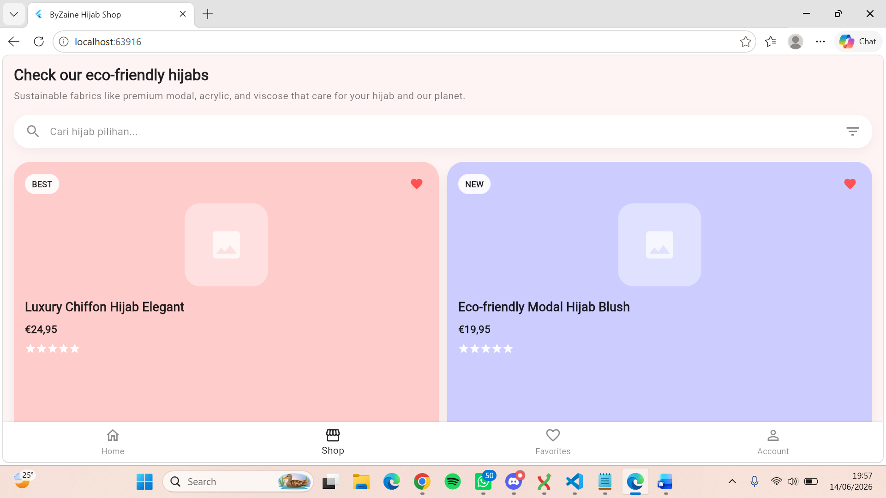
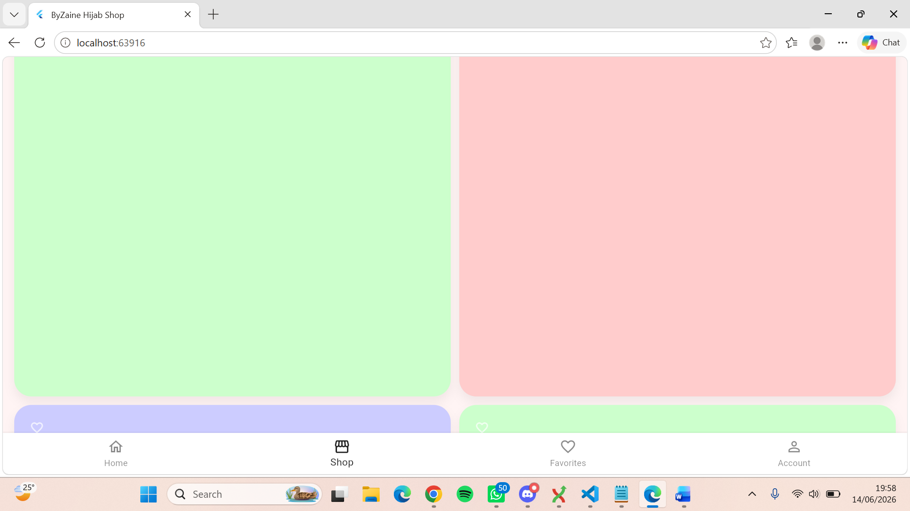

PERBAIKAN
1. flutternya belum responsive ada bukti temuan :
DDC is about to load 1/2 scripts with pool size = 1000
ddc_module_loader.js:1015 DDC is about to load 311/311 scripts with pool size = 1000
 This app is linked to the debug service: ws://127.0.0.1:57116/AF22h7G_l9Q=/ws
ddc_module_loader.js:1586 Starting application from main method in: org-dartlang-app:/web_entrypoint.dart.
_error_dumper_web.dart:15 ══╡ EXCEPTION CAUGHT BY RENDERING LIBRARY ╞═════════════════════════════════════════════════════════
The following assertion was thrown during layout:
A RenderFlex overflowed by 61 pixels on the bottom.

The relevant error-causing widget was:
  Column Column:file:///C:/laragon/www/UAS-Rekayasa-Klmpk1-R.RHijab/frontend/lib/main.dart:998:16

The overflowing RenderFlex has an orientation of Axis.vertical.
The edge of the RenderFlex that is overflowing has been marked in the rendering with a yellow and
black striped pattern. This is usually caused by the contents being too big for the RenderFlex.
Consider applying a flex factor (e.g. using an Expanded widget) to force the children of the
RenderFlex to fit within the available space instead of being sized to their natural size.
This is considered an error condition because it indicates that there is content that cannot be
seen. If the content is legitimately bigger than the available space, consider clipping it with a
ClipRect widget before putting it in the flex, or using a scrollable container rather than a Flex,
like a ListView.
The specific RenderFlex in question is: RenderFlex#4033b OVERFLOWING:
  creator: Column ← Padding ← DecoratedBox ← ConstrainedBox ← Container ← Listener ←
    RawGestureDetector ← GestureDetector ← Semantics ← DefaultSelectionStyle ← Builder ← MouseRegion ←
    ⋯
  parentData: offset=Offset(16.0, 16.0) (can use size)
  constraints: BoxConstraints(w=148.0, h=228.0)
  size: Size(148.0, 228.0)
  direction: vertical
  mainAxisAlignment: start
  mainAxisSize: max
  crossAxisAlignment: start
  textDirection: ltr
  verticalDirection: down
  spacing: 0.0
◢◤◢◤◢◤◢◤◢◤◢◤◢◤◢◤◢◤◢◤◢◤◢◤◢◤◢◤◢◤◢◤◢◤◢◤◢◤◢◤◢◤◢◤◢◤◢◤◢◤◢◤◢◤◢◤◢◤◢◤◢◤◢◤◢◤◢◤◢◤◢◤◢◤◢◤◢◤◢◤◢◤◢◤◢◤◢◤◢◤◢◤◢◤◢◤◢◤◢◤
════════════════════════════════════════════════════════════════════════════════════════════════════
dump @ _error_dumper_web.dart.lib.js:sourcemap:72
dumpErrorToConsole @ _platform_web.dart.lib.js:sourcemap:7419
tear @ dart_sdk.js:sourcemap:3848
reportError @ _platform_web.dart.lib.js:sourcemap:7514
[_reportOverflow] @ text_form_field_row.dart.lib.js:sourcemap:395121
paintOverflowIndicator @ text_form_field_row.dart.lib.js:sourcemap:395160
(anonymous) @ text_form_field_row.dart.lib.js:sourcemap:367283
paint @ text_form_field_row.dart.lib.js:sourcemap:367285
[_paintWithContext] @ text_form_field_row.dart.lib.js:sourcemap:406431
paintChild @ text_form_field_row.dart.lib.js:sourcemap:404320
paint @ text_form_field_row.dart.lib.js:sourcemap:395507
[_paintWithContext] @ text_form_field_row.dart.lib.js:sourcemap:406431
paintChild @ text_form_field_row.dart.lib.js:sourcemap:404320
paint @ text_form_field_row.dart.lib.js:sourcemap:385548
paint @ text_form_field_row.dart.lib.js:sourcemap:388374
[_paintWithContext] @ text_form_field_row.dart.lib.js:sourcemap:406431
paintChild @ text_form_field_row.dart.lib.js:sourcemap:404320
paint @ text_form_field_row.dart.lib.js:sourcemap:385548
[_paintWithContext] @ text_form_field_row.dart.lib.js:sourcemap:406431
paintChild @ text_form_field_row.dart.lib.js:sourcemap:404320
paint @ text_form_field_row.dart.lib.js:sourcemap:385548
[_paintWithContext] @ text_form_field_row.dart.lib.js:sourcemap:406431
paintChild @ text_form_field_row.dart.lib.js:sourcemap:404320
paint @ text_form_field_row.dart.lib.js:sourcemap:385548
[_paintWithContext] @ text_form_field_row.dart.lib.js:sourcemap:406431
paintChild @ text_form_field_row.dart.lib.js:sourcemap:404320
paint @ text_form_field_row.dart.lib.js:sourcemap:385548
[_paintWithContext] @ text_form_field_row.dart.lib.js:sourcemap:406431
paintChild @ text_form_field_row.dart.lib.js:sourcemap:404320
paint @ text_form_field_row.dart.lib.js:sourcemap:385548
[_paintWithContext] @ text_form_field_row.dart.lib.js:sourcemap:406431
paintChild @ text_form_field_row.dart.lib.js:sourcemap:404320
paint @ text_form_field_row.dart.lib.js:sourcemap:385548
[_paintWithContext] @ text_form_field_row.dart.lib.js:sourcemap:406431
_repaintCompositedChild @ text_form_field_row.dart.lib.js:sourcemap:404277
repaintCompositedChild @ text_form_field_row.dart.lib.js:sourcemap:404239
[_compositeChild] @ text_form_field_row.dart.lib.js:sourcemap:404328
paintChild @ text_form_field_row.dart.lib.js:sourcemap:404314
paint @ text_form_field_row.dart.lib.js:sourcemap:385548
[_paintWithContext] @ text_form_field_row.dart.lib.js:sourcemap:406431
paintChild @ text_form_field_row.dart.lib.js:sourcemap:404320
paint @ text_form_field_row.dart.lib.js:sourcemap:359500
[_paintWithContext] @ text_form_field_row.dart.lib.js:sourcemap:406431
paintChild @ text_form_field_row.dart.lib.js:sourcemap:404320
paint @ text_form_field_row.dart.lib.js:sourcemap:356637
[_paintWithContext] @ text_form_field_row.dart.lib.js:sourcemap:406431
paintChild @ text_form_field_row.dart.lib.js:sourcemap:404320
[_paintContents] @ text_form_field_row.dart.lib.js:sourcemap:380039
paint @ text_form_field_row.dart.lib.js:sourcemap:380029
[_paintWithContext] @ text_form_field_row.dart.lib.js:sourcemap:406431
_repaintCompositedChild @ text_form_field_row.dart.lib.js:sourcemap:404277
repaintCompositedChild @ text_form_field_row.dart.lib.js:sourcemap:404239
[_compositeChild] @ text_form_field_row.dart.lib.js:sourcemap:404328
paintChild @ text_form_field_row.dart.lib.js:sourcemap:404314
paint @ text_form_field_row.dart.lib.js:sourcemap:385548
[_paintWithContext] @ text_form_field_row.dart.lib.js:sourcemap:406431
paintChild @ text_form_field_row.dart.lib.js:sourcemap:404320
paint @ text_form_field_row.dart.lib.js:sourcemap:385548
[_paintWithContext] @ text_form_field_row.dart.lib.js:sourcemap:406431
paintChild @ text_form_field_row.dart.lib.js:sourcemap:404320
paint @ text_form_field_row.dart.lib.js:sourcemap:385548
[_paintWithContext] @ text_form_field_row.dart.lib.js:sourcemap:406431
paintChild @ text_form_field_row.dart.lib.js:sourcemap:404320
paint @ text_form_field_row.dart.lib.js:sourcemap:385548
[_paintWithContext] @ text_form_field_row.dart.lib.js:sourcemap:406431
paintChild @ text_form_field_row.dart.lib.js:sourcemap:404320
paint @ text_form_field_row.dart.lib.js:sourcemap:385548
[_paintWithContext] @ text_form_field_row.dart.lib.js:sourcemap:406431
paintChild @ text_form_field_row.dart.lib.js:sourcemap:404320
paint @ text_form_field_row.dart.lib.js:sourcemap:385548
[_paintWithContext] @ text_form_field_row.dart.lib.js:sourcemap:406431
paintChild @ text_form_field_row.dart.lib.js:sourcemap:404320
paint @ text_form_field_row.dart.lib.js:sourcemap:385548
[_paintWithContext] @ text_form_field_row.dart.lib.js:sourcemap:406431
paintChild @ text_form_field_row.dart.lib.js:sourcemap:404320
defaultPaint @ text_form_field_row.dart.lib.js:sourcemap:412709
paint @ text_form_field_row.dart.lib.js:sourcemap:367257
[_paintWithContext] @ text_form_field_row.dart.lib.js:sourcemap:406431
paintChild @ text_form_field_row.dart.lib.js:sourcemap:404320
paint @ text_form_field_row.dart.lib.js:sourcemap:395507
[_paintWithContext] @ text_form_field_row.dart.lib.js:sourcemap:406431
paintChild @ text_form_field_row.dart.lib.js:sourcemap:404320
paintContents @ text_form_field_row.dart.lib.js:sourcemap:130615
pushLayer @ text_form_field_row.dart.lib.js:sourcemap:404446
pushClipRect @ text_form_field_row.dart.lib.js:sourcemap:404469
paint @ text_form_field_row.dart.lib.js:sourcemap:130619
[_paintWithContext] @ text_form_field_row.dart.lib.js:sourcemap:406431
_repaintCompositedChild @ text_form_field_row.dart.lib.js:sourcemap:404277
repaintCompositedChild @ text_form_field_row.dart.lib.js:sourcemap:404239
[_compositeChild] @ text_form_field_row.dart.lib.js:sourcemap:404328
paintChild @ text_form_field_row.dart.lib.js:sourcemap:404314
paint @ text_form_field_row.dart.lib.js:sourcemap:385548
[_paintWithContext] @ text_form_field_row.dart.lib.js:sourcemap:406431
paintChild @ text_form_field_row.dart.lib.js:sourcemap:404320
paint @ text_form_field_row.dart.lib.js:sourcemap:385548
[_paintWithContext] @ text_form_field_row.dart.lib.js:sourcemap:406431
paintChild @ text_form_field_row.dart.lib.js:sourcemap:404320
paint @ text_form_field_row.dart.lib.js:sourcemap:385548
[_paintWithContext] @ text_form_field_row.dart.lib.js:sourcemap:406431
paintChild @ text_form_field_row.dart.lib.js:sourcemap:404320
paint @ text_form_field_row.dart.lib.js:sourcemap:385548
[_paintWithContext] @ text_form_field_row.dart.lib.js:sourcemap:406431
paintChild @ text_form_field_row.dart.lib.js:sourcemap:404320
paint @ text_form_field_row.dart.lib.js:sourcemap:385548
[_paintWithContext] @ text_form_field_row.dart.lib.js:sourcemap:406431
paintChild @ text_form_field_row.dart.lib.js:sourcemap:404320
paint @ text_form_field_row.dart.lib.js:sourcemap:385548
[_paintWithContext] @ text_form_field_row.dart.lib.js:sourcemap:406431
paintChild @ text_form_field_row.dart.lib.js:sourcemap:404320
paint @ text_form_field_row.dart.lib.js:sourcemap:385548
[_paintWithContext] @ text_form_field_row.dart.lib.js:sourcemap:406431
_repaintCompositedChild @ text_form_field_row.dart.lib.js:sourcemap:404277
repaintCompositedChild @ text_form_field_row.dart.lib.js:sourcemap:404239
[_compositeChild] @ text_form_field_row.dart.lib.js:sourcemap:404328
paintChild @ text_form_field_row.dart.lib.js:sourcemap:404314
paint @ text_form_field_row.dart.lib.js:sourcemap:385548
paint @ text_form_field_row.dart.lib.js:sourcemap:391847
[_paintWithContext] @ text_form_field_row.dart.lib.js:sourcemap:406431
paintChild @ text_form_field_row.dart.lib.js:sourcemap:404320
paint @ text_form_field_row.dart.lib.js:sourcemap:385548
[_paintWithContext] @ text_form_field_row.dart.lib.js:sourcemap:406431
paintChild @ text_form_field_row.dart.lib.js:sourcemap:404320
paint @ text_form_field_row.dart.lib.js:sourcemap:385548
[_paintWithContext] @ text_form_field_row.dart.lib.js:sourcemap:406431
paintChild @ text_form_field_row.dart.lib.js:sourcemap:404320
paint @ text_form_field_row.dart.lib.js:sourcemap:385548
[_paintWithContext] @ text_form_field_row.dart.lib.js:sourcemap:406431
paintChild @ text_form_field_row.dart.lib.js:sourcemap:404320
paint @ text_form_field_row.dart.lib.js:sourcemap:385548
[_paintWithContext] @ text_form_field_row.dart.lib.js:sourcemap:406431
paintChild @ text_form_field_row.dart.lib.js:sourcemap:404320
paint @ text_form_field_row.dart.lib.js:sourcemap:385548
[_paintWithContext] @ text_form_field_row.dart.lib.js:sourcemap:406431
_repaintCompositedChild @ text_form_field_row.dart.lib.js:sourcemap:404277
repaintCompositedChild @ text_form_field_row.dart.lib.js:sourcemap:404239
[_compositeChild] @ text_form_field_row.dart.lib.js:sourcemap:404328
paintChild @ text_form_field_row.dart.lib.js:sourcemap:404314
paint @ text_form_field_row.dart.lib.js:sourcemap:395507
[_paintWithContext] @ text_form_field_row.dart.lib.js:sourcemap:406431
paintChild @ text_form_field_row.dart.lib.js:sourcemap:404320
defaultPaint @ text_form_field_row.dart.lib.js:sourcemap:412709
paint @ text_form_field_row.dart.lib.js:sourcemap:392756
[_paintWithContext] @ text_form_field_row.dart.lib.js:sourcemap:406431
paintChild @ text_form_field_row.dart.lib.js:sourcemap:404320
paint @ text_form_field_row.dart.lib.js:sourcemap:385548
paint @ time.dart.lib.js:sourcemap:164180
[_paintWithContext] @ text_form_field_row.dart.lib.js:sourcemap:406431
paintChild @ text_form_field_row.dart.lib.js:sourcemap:404320
paint @ text_form_field_row.dart.lib.js:sourcemap:385548
(anonymous) @ text_form_field_row.dart.lib.js:sourcemap:388046
pushClipRRect @ text_form_field_row.dart.lib.js:sourcemap:404481
paint @ text_form_field_row.dart.lib.js:sourcemap:388035
[_paintWithContext] @ text_form_field_row.dart.lib.js:sourcemap:406431
paintChild @ text_form_field_row.dart.lib.js:sourcemap:404320
paint @ text_form_field_row.dart.lib.js:sourcemap:385548
[_paintWithContext] @ text_form_field_row.dart.lib.js:sourcemap:406431
paintChild @ text_form_field_row.dart.lib.js:sourcemap:404320
paint @ text_form_field_row.dart.lib.js:sourcemap:385548
[_paintWithContext] @ text_form_field_row.dart.lib.js:sourcemap:406431
_repaintCompositedChild @ text_form_field_row.dart.lib.js:sourcemap:404277
repaintCompositedChild @ text_form_field_row.dart.lib.js:sourcemap:404239
[_compositeChild] @ text_form_field_row.dart.lib.js:sourcemap:404328
paintChild @ text_form_field_row.dart.lib.js:sourcemap:404314
paint @ text_form_field_row.dart.lib.js:sourcemap:385548
[_paintWithContext] @ text_form_field_row.dart.lib.js:sourcemap:406431
paintChild @ text_form_field_row.dart.lib.js:sourcemap:404320
paint @ text_form_field_row.dart.lib.js:sourcemap:385548
tear @ dart_sdk.js:sourcemap:3879
paint @ time.dart.lib.js:sourcemap:38338
paint @ text_form_field_row.dart.lib.js:sourcemap:124095
[_paintWithContext] @ text_form_field_row.dart.lib.js:sourcemap:406431
paintChild @ text_form_field_row.dart.lib.js:sourcemap:404320
paint @ text_form_field_row.dart.lib.js:sourcemap:385548
tear @ dart_sdk.js:sourcemap:3879
paint @ time.dart.lib.js:sourcemap:38206
paint @ text_form_field_row.dart.lib.js:sourcemap:124095
[_paintWithContext] @ text_form_field_row.dart.lib.js:sourcemap:406431
paintChild @ text_form_field_row.dart.lib.js:sourcemap:404320
paint @ text_form_field_row.dart.lib.js:sourcemap:385548
tear @ dart_sdk.js:sourcemap:3879
paint @ time.dart.lib.js:sourcemap:38338
paint @ text_form_field_row.dart.lib.js:sourcemap:124095
[_paintWithContext] @ text_form_field_row.dart.lib.js:sourcemap:406431
paintChild @ text_form_field_row.dart.lib.js:sourcemap:404320
paint @ text_form_field_row.dart.lib.js:sourcemap:385548
tear @ dart_sdk.js:sourcemap:3879
paint @ time.dart.lib.js:sourcemap:38206
paint @ text_form_field_row.dart.lib.js:sourcemap:124095
[_paintWithContext] @ text_form_field_row.dart.lib.js:sourcemap:406431
paintChild @ text_form_field_row.dart.lib.js:sourcemap:404320
paint @ text_form_field_row.dart.lib.js:sourcemap:385548
[_paintWithContext] @ text_form_field_row.dart.lib.js:sourcemap:406431
_repaintCompositedChild @ text_form_field_row.dart.lib.js:sourcemap:404277
repaintCompositedChild @ text_form_field_row.dart.lib.js:sourcemap:404239
[_compositeChild] @ text_form_field_row.dart.lib.js:sourcemap:404328
paintChild @ text_form_field_row.dart.lib.js:sourcemap:404314
paint @ text_form_field_row.dart.lib.js:sourcemap:385548
[_paintWithContext] @ text_form_field_row.dart.lib.js:sourcemap:406431
paintChild @ text_form_field_row.dart.lib.js:sourcemap:404320
paint @ text_form_field_row.dart.lib.js:sourcemap:385548
setTimeout
dartDevEmbedder.defineLibrary._isolate_helper.TimerImpl.new @ dart_sdk.js:sourcemap:22095
_createTimer @ dart_sdk.js:sourcemap:38648
createTimer @ dart_sdk.js:sourcemap:39532
new @ dart_sdk.js:sourcemap:38657
run @ dart_sdk.js:sourcemap:38675
scheduleWarmUpFrame @ dart_sdk.js:sourcemap:202094
scheduleWarmUpFrame @ dart_sdk.js:sourcemap:210536
scheduleWarmUpFrame @ binding.dart.lib.js:sourcemap:988
(anonymous) @ text_form_field_row.dart.lib.js:sourcemap:334897
_runWidget @ text_form_field_row.dart.lib.js:sourcemap:334899
runApp @ text_form_field_row.dart.lib.js:sourcemap:334883
main$ @ main.dart.lib.js:sourcemap:9190
tear @ dart_sdk.js:sourcemap:3848
(anonymous) @ web_entrypoint.dart:24
(anonymous) @ initialization.dart:39
(anonymous) @ async_patch.dart:618
(anonymous) @ async_patch.dart:643
(anonymous) @ async_patch.dart:589
runUnary @ zone.dart:962
handleValue @ future_impl.dart:222
handleValueCallback @ future_impl.dart:948
_propagateToListeners @ future_impl.dart:977
(anonymous) @ future_impl.dart:720
(anonymous) @ future_impl.dart:804
(anonymous) @ schedule_microtask.dart:40
_startMicrotaskLoop @ schedule_microtask.dart:49
(anonymous) @ operations.dart:118
(anonymous) @ async_patch.dart:183
Promise.then
_scheduleImmediateWithPromise @ dart_sdk.js:sourcemap:34190
_scheduleImmediate @ dart_sdk.js:sourcemap:34174
_scheduleAsyncCallback @ dart_sdk.js:sourcemap:41319
_rootScheduleMicrotask @ dart_sdk.js:sourcemap:41587
scheduleMicrotask @ dart_sdk.js:sourcemap:39529
[_asyncCompleteWithValue] @ dart_sdk.js:sourcemap:33768
[_asyncComplete] @ dart_sdk.js:sourcemap:33750
dartDevEmbedder.defineLibrary.async._Future.immediate @ dart_sdk.js:sourcemap:34004
value @ dart_sdk.js:sourcemap:32556
dartDevEmbedder.defineLibrary._engine.EngineFlutterWindow.__ @ dart_sdk.js:sourcemap:240278
implicit @ dart_sdk.js:sourcemap:239482
ensureImplicitViewInitialized @ dart_sdk.js:sourcemap:249491
(anonymous) @ dart_sdk.js:sourcemap:247070
(anonymous) @ dart_sdk.js:sourcemap:40935
(anonymous) @ dart_sdk.js:sourcemap:40945
_asyncStartSync @ dart_sdk.js:sourcemap:40893
initializeEngineUi @ dart_sdk.js:sourcemap:247077
(anonymous) @ dart_sdk.js:sourcemap:182923
(anonymous) @ dart_sdk.js:sourcemap:40935
(anonymous) @ dart_sdk.js:sourcemap:40945
_asyncStartSync @ dart_sdk.js:sourcemap:40893
(anonymous) @ dart_sdk.js:sourcemap:182931
(anonymous) @ dart_sdk.js:sourcemap:188843
(anonymous) @ dart_sdk.js:sourcemap:40935
(anonymous) @ dart_sdk.js:sourcemap:40945
_asyncStartSync @ dart_sdk.js:sourcemap:40893
(anonymous) @ dart_sdk.js:sourcemap:188855
(anonymous) @ dart_sdk.js:sourcemap:247258
_callDartFunctionFast1 @ dart_sdk.js:sourcemap:72359
ret @ dart_sdk.js:sourcemap:72273
(anonymous) @ flutter_bootstrap.js:sourcemap:1
Promise.then
a @ flutter_bootstrap.js:1
didCreateEngineInitializer @ flutter_bootstrap.js:1
(anonymous) @ initialization.dart:50
(anonymous) @ async_patch.dart:618
(anonymous) @ async_patch.dart:643
_asyncStartSync @ async_patch.dart:537
(anonymous) @ initialization.dart:27
(anonymous) @ web_entrypoint.dart:19
(anonymous) @ async_patch.dart:618
(anonymous) @ async_patch.dart:643
_asyncStartSync @ async_patch.dart:537
(anonymous) @ web_entrypoint.dart:18
runMainAndHandleErrors @ ddc_module_loader.js:1557
_runMain @ ddc_module_loader.js:1579
runMain @ ddc_module_loader.js:1593
runMain @ ddc_module_loader.js:2140
child.main @ main_module.bootstrap.js:25
(anonymous) @ main_module.bootstrap.js:33
window.$dartRunMain @ main_module.bootstrap.js:32
(anonymous) @ (unknown)
runMain @ client.js:10436
(anonymous) @ client.js:26985
(anonymous) @ client.js:3893
call$2 @ client.js:13631
_asyncStartSync @ client.js:3857
$call$body$main__closure @ client.js:27054
call$1 @ client.js:26892
_rootRunUnary @ client.js:4391
runUnary$2$2 @ client.js:15254
runUnaryGuarded$1$2 @ client.js:15201
_sendData$1 @ client.js:14739
_add$1 @ client.js:14684
_add$1 @ client.js:15080
_handleData$2 @ client.js:15140
_handleData$1 @ client.js:15106
(anonymous) @ client.js:1637
_rootRunUnary @ client.js:4391
runUnary$2$2 @ client.js:15254
runUnaryGuarded$1$2 @ client.js:15201
__internal$_onData$1 @ client.js:11639
(anonymous) @ client.js:1637
_rootRunUnary @ client.js:4391
runUnary$2$2 @ client.js:15254
runUnaryGuarded$1$2 @ client.js:15201
_sendData$1 @ client.js:14739
perform$1 @ client.js:14914
call$0 @ client.js:14973
_rootRun @ client.js:4372
run$1$1 @ client.js:15246
runGuarded$1 @ client.js:15189
call$0 @ client.js:15378
_rootRun @ client.js:4376
run$1$1 @ client.js:15246
runGuarded$1 @ client.js:15189
call$0 @ client.js:15378
_microtaskLoop @ client.js:4220
_startMicrotaskLoop @ client.js:4226
call$1 @ client.js:13509
PendingScript
runMain @ client.js:10436
(anonymous) @ client.js:26985
(anonymous) @ client.js:3893
call$2 @ client.js:13631
_asyncStartSync @ client.js:3857
$call$body$main__closure @ client.js:27054
call$1 @ client.js:26892
_rootRunUnary @ client.js:4391
runUnary$2$2 @ client.js:15254
runUnaryGuarded$1$2 @ client.js:15201
_sendData$1 @ client.js:14739
_add$1 @ client.js:14684
_add$1 @ client.js:15080
_handleData$2 @ client.js:15140
_handleData$1 @ client.js:15106
(anonymous) @ client.js:1637
_rootRunUnary @ client.js:4391
runUnary$2$2 @ client.js:15254
runUnaryGuarded$1$2 @ client.js:15201
__internal$_onData$1 @ client.js:11639
(anonymous) @ client.js:1637
_rootRunUnary @ client.js:4391
runUnary$2$2 @ client.js:15254
runUnaryGuarded$1$2 @ client.js:15201
_sendData$1 @ client.js:14739
perform$1 @ client.js:14914
call$0 @ client.js:14973
_rootRun @ client.js:4372
run$1$1 @ client.js:15246
runGuarded$1 @ client.js:15189
call$0 @ client.js:15378
_rootRun @ client.js:4376
run$1$1 @ client.js:15246
runGuarded$1 @ client.js:15189
call$0 @ client.js:15378
_microtaskLoop @ client.js:4220
_startMicrotaskLoop @ client.js:4226
call$1 @ client.js:13509
childList
call$1 @ client.js:13519
_scheduleAsyncCallback @ client.js:4240
_rootScheduleMicrotask @ client.js:4442
scheduleMicrotask$1 @ client.js:15298
scheduleMicrotask @ client.js:4281
schedule$1 @ client.js:14945
_addPending$1 @ client.js:14730
_sendData$1 @ client.js:14515
_add$1 @ client.js:14408
add$1 @ client.js:14373
call$1 @ client.js:26576
call$1 @ client.js:26522
_rootRunUnary @ client.js:4395
runUnary$2$2 @ client.js:15254
runUnaryGuarded$1$2 @ client.js:15201
call$1 @ client.js:15385
_callDartFunctionFast1 @ client.js:7834
(anonymous) @ client.js:7810
2_error_dumper_web.dart:15 Another exception was thrown: A RenderFlex overflowed by 61 pixels on the bottom.
dump @ _error_dumper_web.dart.lib.js:sourcemap:72
dumpErrorToConsole @ _platform_web.dart.lib.js:sourcemap:7424
tear @ dart_sdk.js:sourcemap:3848
reportError @ _platform_web.dart.lib.js:sourcemap:7514
[_reportOverflow] @ text_form_field_row.dart.lib.js:sourcemap:395121
paintOverflowIndicator @ text_form_field_row.dart.lib.js:sourcemap:395160
(anonymous) @ text_form_field_row.dart.lib.js:sourcemap:367283
paint @ text_form_field_row.dart.lib.js:sourcemap:367285
[_paintWithContext] @ text_form_field_row.dart.lib.js:sourcemap:406431
paintChild @ text_form_field_row.dart.lib.js:sourcemap:404320
paint @ text_form_field_row.dart.lib.js:sourcemap:395507
[_paintWithContext] @ text_form_field_row.dart.lib.js:sourcemap:406431
paintChild @ text_form_field_row.dart.lib.js:sourcemap:404320
paint @ text_form_field_row.dart.lib.js:sourcemap:385548
paint @ text_form_field_row.dart.lib.js:sourcemap:388374
[_paintWithContext] @ text_form_field_row.dart.lib.js:sourcemap:406431
paintChild @ text_form_field_row.dart.lib.js:sourcemap:404320
paint @ text_form_field_row.dart.lib.js:sourcemap:385548
[_paintWithContext] @ text_form_field_row.dart.lib.js:sourcemap:406431
paintChild @ text_form_field_row.dart.lib.js:sourcemap:404320
paint @ text_form_field_row.dart.lib.js:sourcemap:385548
[_paintWithContext] @ text_form_field_row.dart.lib.js:sourcemap:406431
paintChild @ text_form_field_row.dart.lib.js:sourcemap:404320
paint @ text_form_field_row.dart.lib.js:sourcemap:385548
[_paintWithContext] @ text_form_field_row.dart.lib.js:sourcemap:406431
paintChild @ text_form_field_row.dart.lib.js:sourcemap:404320
paint @ text_form_field_row.dart.lib.js:sourcemap:385548
[_paintWithContext] @ text_form_field_row.dart.lib.js:sourcemap:406431
paintChild @ text_form_field_row.dart.lib.js:sourcemap:404320
paint @ text_form_field_row.dart.lib.js:sourcemap:385548
[_paintWithContext] @ text_form_field_row.dart.lib.js:sourcemap:406431
paintChild @ text_form_field_row.dart.lib.js:sourcemap:404320
paint @ text_form_field_row.dart.lib.js:sourcemap:385548
[_paintWithContext] @ text_form_field_row.dart.lib.js:sourcemap:406431
_repaintCompositedChild @ text_form_field_row.dart.lib.js:sourcemap:404277
repaintCompositedChild @ text_form_field_row.dart.lib.js:sourcemap:404239
[_compositeChild] @ text_form_field_row.dart.lib.js:sourcemap:404328
paintChild @ text_form_field_row.dart.lib.js:sourcemap:404314
paint @ text_form_field_row.dart.lib.js:sourcemap:385548
[_paintWithContext] @ text_form_field_row.dart.lib.js:sourcemap:406431
paintChild @ text_form_field_row.dart.lib.js:sourcemap:404320
paint @ text_form_field_row.dart.lib.js:sourcemap:359500
[_paintWithContext] @ text_form_field_row.dart.lib.js:sourcemap:406431
paintChild @ text_form_field_row.dart.lib.js:sourcemap:404320
paint @ text_form_field_row.dart.lib.js:sourcemap:356637
[_paintWithContext] @ text_form_field_row.dart.lib.js:sourcemap:406431
paintChild @ text_form_field_row.dart.lib.js:sourcemap:404320
[_paintContents] @ text_form_field_row.dart.lib.js:sourcemap:380039
paint @ text_form_field_row.dart.lib.js:sourcemap:380029
[_paintWithContext] @ text_form_field_row.dart.lib.js:sourcemap:406431
_repaintCompositedChild @ text_form_field_row.dart.lib.js:sourcemap:404277
repaintCompositedChild @ text_form_field_row.dart.lib.js:sourcemap:404239
[_compositeChild] @ text_form_field_row.dart.lib.js:sourcemap:404328
paintChild @ text_form_field_row.dart.lib.js:sourcemap:404314
paint @ text_form_field_row.dart.lib.js:sourcemap:385548
[_paintWithContext] @ text_form_field_row.dart.lib.js:sourcemap:406431
paintChild @ text_form_field_row.dart.lib.js:sourcemap:404320
paint @ text_form_field_row.dart.lib.js:sourcemap:385548
[_paintWithContext] @ text_form_field_row.dart.lib.js:sourcemap:406431
paintChild @ text_form_field_row.dart.lib.js:sourcemap:404320
paint @ text_form_field_row.dart.lib.js:sourcemap:385548
[_paintWithContext] @ text_form_field_row.dart.lib.js:sourcemap:406431
paintChild @ text_form_field_row.dart.lib.js:sourcemap:404320
paint @ text_form_field_row.dart.lib.js:sourcemap:385548
[_paintWithContext] @ text_form_field_row.dart.lib.js:sourcemap:406431
paintChild @ text_form_field_row.dart.lib.js:sourcemap:404320
paint @ text_form_field_row.dart.lib.js:sourcemap:385548
[_paintWithContext] @ text_form_field_row.dart.lib.js:sourcemap:406431
paintChild @ text_form_field_row.dart.lib.js:sourcemap:404320
paint @ text_form_field_row.dart.lib.js:sourcemap:385548
[_paintWithContext] @ text_form_field_row.dart.lib.js:sourcemap:406431
paintChild @ text_form_field_row.dart.lib.js:sourcemap:404320
paint @ text_form_field_row.dart.lib.js:sourcemap:385548
[_paintWithContext] @ text_form_field_row.dart.lib.js:sourcemap:406431
paintChild @ text_form_field_row.dart.lib.js:sourcemap:404320
defaultPaint @ text_form_field_row.dart.lib.js:sourcemap:412709
paint @ text_form_field_row.dart.lib.js:sourcemap:367257
[_paintWithContext] @ text_form_field_row.dart.lib.js:sourcemap:406431
paintChild @ text_form_field_row.dart.lib.js:sourcemap:404320
paint @ text_form_field_row.dart.lib.js:sourcemap:395507
[_paintWithContext] @ text_form_field_row.dart.lib.js:sourcemap:406431
paintChild @ text_form_field_row.dart.lib.js:sourcemap:404320
paintContents @ text_form_field_row.dart.lib.js:sourcemap:130615
pushLayer @ text_form_field_row.dart.lib.js:sourcemap:404446
pushClipRect @ text_form_field_row.dart.lib.js:sourcemap:404469
paint @ text_form_field_row.dart.lib.js:sourcemap:130619
[_paintWithContext] @ text_form_field_row.dart.lib.js:sourcemap:406431
_repaintCompositedChild @ text_form_field_row.dart.lib.js:sourcemap:404277
repaintCompositedChild @ text_form_field_row.dart.lib.js:sourcemap:404239
[_compositeChild] @ text_form_field_row.dart.lib.js:sourcemap:404328
paintChild @ text_form_field_row.dart.lib.js:sourcemap:404314
paint @ text_form_field_row.dart.lib.js:sourcemap:385548
[_paintWithContext] @ text_form_field_row.dart.lib.js:sourcemap:406431
paintChild @ text_form_field_row.dart.lib.js:sourcemap:404320
paint @ text_form_field_row.dart.lib.js:sourcemap:385548
[_paintWithContext] @ text_form_field_row.dart.lib.js:sourcemap:406431
paintChild @ text_form_field_row.dart.lib.js:sourcemap:404320
paint @ text_form_field_row.dart.lib.js:sourcemap:385548
[_paintWithContext] @ text_form_field_row.dart.lib.js:sourcemap:406431
paintChild @ text_form_field_row.dart.lib.js:sourcemap:404320
paint @ text_form_field_row.dart.lib.js:sourcemap:385548
[_paintWithContext] @ text_form_field_row.dart.lib.js:sourcemap:406431
paintChild @ text_form_field_row.dart.lib.js:sourcemap:404320
paint @ text_form_field_row.dart.lib.js:sourcemap:385548
[_paintWithContext] @ text_form_field_row.dart.lib.js:sourcemap:406431
paintChild @ text_form_field_row.dart.lib.js:sourcemap:404320
paint @ text_form_field_row.dart.lib.js:sourcemap:385548
[_paintWithContext] @ text_form_field_row.dart.lib.js:sourcemap:406431
paintChild @ text_form_field_row.dart.lib.js:sourcemap:404320
paint @ text_form_field_row.dart.lib.js:sourcemap:385548
[_paintWithContext] @ text_form_field_row.dart.lib.js:sourcemap:406431
_repaintCompositedChild @ text_form_field_row.dart.lib.js:sourcemap:404277
repaintCompositedChild @ text_form_field_row.dart.lib.js:sourcemap:404239
[_compositeChild] @ text_form_field_row.dart.lib.js:sourcemap:404328
paintChild @ text_form_field_row.dart.lib.js:sourcemap:404314
paint @ text_form_field_row.dart.lib.js:sourcemap:385548
paint @ text_form_field_row.dart.lib.js:sourcemap:391847
[_paintWithContext] @ text_form_field_row.dart.lib.js:sourcemap:406431
paintChild @ text_form_field_row.dart.lib.js:sourcemap:404320
paint @ text_form_field_row.dart.lib.js:sourcemap:385548
[_paintWithContext] @ text_form_field_row.dart.lib.js:sourcemap:406431
paintChild @ text_form_field_row.dart.lib.js:sourcemap:404320
paint @ text_form_field_row.dart.lib.js:sourcemap:385548
[_paintWithContext] @ text_form_field_row.dart.lib.js:sourcemap:406431
paintChild @ text_form_field_row.dart.lib.js:sourcemap:404320
paint @ text_form_field_row.dart.lib.js:sourcemap:385548
[_paintWithContext] @ text_form_field_row.dart.lib.js:sourcemap:406431
paintChild @ text_form_field_row.dart.lib.js:sourcemap:404320
paint @ text_form_field_row.dart.lib.js:sourcemap:385548
[_paintWithContext] @ text_form_field_row.dart.lib.js:sourcemap:406431
paintChild @ text_form_field_row.dart.lib.js:sourcemap:404320
paint @ text_form_field_row.dart.lib.js:sourcemap:385548
[_paintWithContext] @ text_form_field_row.dart.lib.js:sourcemap:406431
_repaintCompositedChild @ text_form_field_row.dart.lib.js:sourcemap:404277
repaintCompositedChild @ text_form_field_row.dart.lib.js:sourcemap:404239
[_compositeChild] @ text_form_field_row.dart.lib.js:sourcemap:404328
paintChild @ text_form_field_row.dart.lib.js:sourcemap:404314
paint @ text_form_field_row.dart.lib.js:sourcemap:395507
[_paintWithContext] @ text_form_field_row.dart.lib.js:sourcemap:406431
paintChild @ text_form_field_row.dart.lib.js:sourcemap:404320
defaultPaint @ text_form_field_row.dart.lib.js:sourcemap:412709
paint @ text_form_field_row.dart.lib.js:sourcemap:392756
[_paintWithContext] @ text_form_field_row.dart.lib.js:sourcemap:406431
paintChild @ text_form_field_row.dart.lib.js:sourcemap:404320
paint @ text_form_field_row.dart.lib.js:sourcemap:385548
paint @ time.dart.lib.js:sourcemap:164180
[_paintWithContext] @ text_form_field_row.dart.lib.js:sourcemap:406431
paintChild @ text_form_field_row.dart.lib.js:sourcemap:404320
paint @ text_form_field_row.dart.lib.js:sourcemap:385548
(anonymous) @ text_form_field_row.dart.lib.js:sourcemap:388046
pushClipRRect @ text_form_field_row.dart.lib.js:sourcemap:404481
paint @ text_form_field_row.dart.lib.js:sourcemap:388035
[_paintWithContext] @ text_form_field_row.dart.lib.js:sourcemap:406431
paintChild @ text_form_field_row.dart.lib.js:sourcemap:404320
paint @ text_form_field_row.dart.lib.js:sourcemap:385548
[_paintWithContext] @ text_form_field_row.dart.lib.js:sourcemap:406431
paintChild @ text_form_field_row.dart.lib.js:sourcemap:404320
paint @ text_form_field_row.dart.lib.js:sourcemap:385548
[_paintWithContext] @ text_form_field_row.dart.lib.js:sourcemap:406431
_repaintCompositedChild @ text_form_field_row.dart.lib.js:sourcemap:404277
repaintCompositedChild @ text_form_field_row.dart.lib.js:sourcemap:404239
[_compositeChild] @ text_form_field_row.dart.lib.js:sourcemap:404328
paintChild @ text_form_field_row.dart.lib.js:sourcemap:404314
paint @ text_form_field_row.dart.lib.js:sourcemap:385548
[_paintWithContext] @ text_form_field_row.dart.lib.js:sourcemap:406431
paintChild @ text_form_field_row.dart.lib.js:sourcemap:404320
paint @ text_form_field_row.dart.lib.js:sourcemap:385548
tear @ dart_sdk.js:sourcemap:3879
paint @ time.dart.lib.js:sourcemap:38338
paint @ text_form_field_row.dart.lib.js:sourcemap:124095
[_paintWithContext] @ text_form_field_row.dart.lib.js:sourcemap:406431
paintChild @ text_form_field_row.dart.lib.js:sourcemap:404320
paint @ text_form_field_row.dart.lib.js:sourcemap:385548
tear @ dart_sdk.js:sourcemap:3879
paint @ time.dart.lib.js:sourcemap:38206
paint @ text_form_field_row.dart.lib.js:sourcemap:124095
[_paintWithContext] @ text_form_field_row.dart.lib.js:sourcemap:406431
paintChild @ text_form_field_row.dart.lib.js:sourcemap:404320
paint @ text_form_field_row.dart.lib.js:sourcemap:385548
tear @ dart_sdk.js:sourcemap:3879
paint @ time.dart.lib.js:sourcemap:38338
paint @ text_form_field_row.dart.lib.js:sourcemap:124095
[_paintWithContext] @ text_form_field_row.dart.lib.js:sourcemap:406431
paintChild @ text_form_field_row.dart.lib.js:sourcemap:404320
paint @ text_form_field_row.dart.lib.js:sourcemap:385548
tear @ dart_sdk.js:sourcemap:3879
paint @ time.dart.lib.js:sourcemap:38206
paint @ text_form_field_row.dart.lib.js:sourcemap:124095
[_paintWithContext] @ text_form_field_row.dart.lib.js:sourcemap:406431
paintChild @ text_form_field_row.dart.lib.js:sourcemap:404320
paint @ text_form_field_row.dart.lib.js:sourcemap:385548
[_paintWithContext] @ text_form_field_row.dart.lib.js:sourcemap:406431
_repaintCompositedChild @ text_form_field_row.dart.lib.js:sourcemap:404277
repaintCompositedChild @ text_form_field_row.dart.lib.js:sourcemap:404239
[_compositeChild] @ text_form_field_row.dart.lib.js:sourcemap:404328
paintChild @ text_form_field_row.dart.lib.js:sourcemap:404314
paint @ text_form_field_row.dart.lib.js:sourcemap:385548
[_paintWithContext] @ text_form_field_row.dart.lib.js:sourcemap:406431
paintChild @ text_form_field_row.dart.lib.js:sourcemap:404320
paint @ text_form_field_row.dart.lib.js:sourcemap:385548
setTimeout
dartDevEmbedder.defineLibrary._isolate_helper.TimerImpl.new @ dart_sdk.js:sourcemap:22095
_createTimer @ dart_sdk.js:sourcemap:38648
createTimer @ dart_sdk.js:sourcemap:39532
new @ dart_sdk.js:sourcemap:38657
run @ dart_sdk.js:sourcemap:38675
scheduleWarmUpFrame @ dart_sdk.js:sourcemap:202094
scheduleWarmUpFrame @ dart_sdk.js:sourcemap:210536
scheduleWarmUpFrame @ binding.dart.lib.js:sourcemap:988
(anonymous) @ text_form_field_row.dart.lib.js:sourcemap:334897
_runWidget @ text_form_field_row.dart.lib.js:sourcemap:334899
runApp @ text_form_field_row.dart.lib.js:sourcemap:334883
main$ @ main.dart.lib.js:sourcemap:9190
tear @ dart_sdk.js:sourcemap:3848
(anonymous) @ web_entrypoint.dart:24
(anonymous) @ initialization.dart:39
(anonymous) @ async_patch.dart:618
(anonymous) @ async_patch.dart:643
(anonymous) @ async_patch.dart:589
runUnary @ zone.dart:962
handleValue @ future_impl.dart:222
handleValueCallback @ future_impl.dart:948
_propagateToListeners @ future_impl.dart:977
(anonymous) @ future_impl.dart:720
(anonymous) @ future_impl.dart:804
(anonymous) @ schedule_microtask.dart:40
_startMicrotaskLoop @ schedule_microtask.dart:49
(anonymous) @ operations.dart:118
(anonymous) @ async_patch.dart:183
Promise.then
_scheduleImmediateWithPromise @ dart_sdk.js:sourcemap:34190
_scheduleImmediate @ dart_sdk.js:sourcemap:34174
_scheduleAsyncCallback @ dart_sdk.js:sourcemap:41319
_rootScheduleMicrotask @ dart_sdk.js:sourcemap:41587
scheduleMicrotask @ dart_sdk.js:sourcemap:39529
[_asyncCompleteWithValue] @ dart_sdk.js:sourcemap:33768
[_asyncComplete] @ dart_sdk.js:sourcemap:33750
dartDevEmbedder.defineLibrary.async._Future.immediate @ dart_sdk.js:sourcemap:34004
value @ dart_sdk.js:sourcemap:32556
dartDevEmbedder.defineLibrary._engine.EngineFlutterWindow.__ @ dart_sdk.js:sourcemap:240278
implicit @ dart_sdk.js:sourcemap:239482
ensureImplicitViewInitialized @ dart_sdk.js:sourcemap:249491
(anonymous) @ dart_sdk.js:sourcemap:247070
(anonymous) @ dart_sdk.js:sourcemap:40935
(anonymous) @ dart_sdk.js:sourcemap:40945
_asyncStartSync @ dart_sdk.js:sourcemap:40893
initializeEngineUi @ dart_sdk.js:sourcemap:247077
(anonymous) @ dart_sdk.js:sourcemap:182923
(anonymous) @ dart_sdk.js:sourcemap:40935
(anonymous) @ dart_sdk.js:sourcemap:40945
_asyncStartSync @ dart_sdk.js:sourcemap:40893
(anonymous) @ dart_sdk.js:sourcemap:182931
(anonymous) @ dart_sdk.js:sourcemap:188843
(anonymous) @ dart_sdk.js:sourcemap:40935
(anonymous) @ dart_sdk.js:sourcemap:40945
_asyncStartSync @ dart_sdk.js:sourcemap:40893
(anonymous) @ dart_sdk.js:sourcemap:188855
(anonymous) @ dart_sdk.js:sourcemap:247258
_callDartFunctionFast1 @ dart_sdk.js:sourcemap:72359
ret @ dart_sdk.js:sourcemap:72273
(anonymous) @ flutter_bootstrap.js:sourcemap:1
Promise.then
a @ flutter_bootstrap.js:1
didCreateEngineInitializer @ flutter_bootstrap.js:1
(anonymous) @ initialization.dart:50
(anonymous) @ async_patch.dart:618
(anonymous) @ async_patch.dart:643
_asyncStartSync @ async_patch.dart:537
(anonymous) @ initialization.dart:27
(anonymous) @ web_entrypoint.dart:19
(anonymous) @ async_patch.dart:618
(anonymous) @ async_patch.dart:643
_asyncStartSync @ async_patch.dart:537
(anonymous) @ web_entrypoint.dart:18
runMainAndHandleErrors @ ddc_module_loader.js:1557
_runMain @ ddc_module_loader.js:1579
runMain @ ddc_module_loader.js:1593
runMain @ ddc_module_loader.js:2140
child.main @ main_module.bootstrap.js:25
(anonymous) @ main_module.bootstrap.js:33
window.$dartRunMain @ main_module.bootstrap.js:32
(anonymous) @ (unknown)
runMain @ client.js:10436
(anonymous) @ client.js:26985
(anonymous) @ client.js:3893
call$2 @ client.js:13631
_asyncStartSync @ client.js:3857
$call$body$main__closure @ client.js:27054
call$1 @ client.js:26892
_rootRunUnary @ client.js:4391
runUnary$2$2 @ client.js:15254
runUnaryGuarded$1$2 @ client.js:15201
_sendData$1 @ client.js:14739
_add$1 @ client.js:14684
_add$1 @ client.js:15080
_handleData$2 @ client.js:15140
_handleData$1 @ client.js:15106
(anonymous) @ client.js:1637
_rootRunUnary @ client.js:4391
runUnary$2$2 @ client.js:15254
runUnaryGuarded$1$2 @ client.js:15201
__internal$_onData$1 @ client.js:11639
(anonymous) @ client.js:1637
_rootRunUnary @ client.js:4391
runUnary$2$2 @ client.js:15254
runUnaryGuarded$1$2 @ client.js:15201
_sendData$1 @ client.js:14739
perform$1 @ client.js:14914
call$0 @ client.js:14973
_rootRun @ client.js:4372
run$1$1 @ client.js:15246
runGuarded$1 @ client.js:15189
call$0 @ client.js:15378
_rootRun @ client.js:4376
run$1$1 @ client.js:15246
runGuarded$1 @ client.js:15189
call$0 @ client.js:15378
_microtaskLoop @ client.js:4220
_startMicrotaskLoop @ client.js:4226
call$1 @ client.js:13509
PendingScript
runMain @ client.js:10436
(anonymous) @ client.js:26985
(anonymous) @ client.js:3893
call$2 @ client.js:13631
_asyncStartSync @ client.js:3857
$call$body$main__closure @ client.js:27054
call$1 @ client.js:26892
_rootRunUnary @ client.js:4391
runUnary$2$2 @ client.js:15254
runUnaryGuarded$1$2 @ client.js:15201
_sendData$1 @ client.js:14739
_add$1 @ client.js:14684
_add$1 @ client.js:15080
_handleData$2 @ client.js:15140
_handleData$1 @ client.js:15106
(anonymous) @ client.js:1637
_rootRunUnary @ client.js:4391
runUnary$2$2 @ client.js:15254
runUnaryGuarded$1$2 @ client.js:15201
__internal$_onData$1 @ client.js:11639
(anonymous) @ client.js:1637
_rootRunUnary @ client.js:4391
runUnary$2$2 @ client.js:15254
runUnaryGuarded$1$2 @ client.js:15201
_sendData$1 @ client.js:14739
perform$1 @ client.js:14914
call$0 @ client.js:14973
_rootRun @ client.js:4372
run$1$1 @ client.js:15246
runGuarded$1 @ client.js:15189
call$0 @ client.js:15378
_rootRun @ client.js:4376
run$1$1 @ client.js:15246
runGuarded$1 @ client.js:15189
call$0 @ client.js:15378
_microtaskLoop @ client.js:4220
_startMicrotaskLoop @ client.js:4226
call$1 @ client.js:13509
childList
call$1 @ client.js:13519
_scheduleAsyncCallback @ client.js:4240
_rootScheduleMicrotask @ client.js:4442
scheduleMicrotask$1 @ client.js:15298
scheduleMicrotask @ client.js:4281
schedule$1 @ client.js:14945
_addPending$1 @ client.js:14730
_sendData$1 @ client.js:14515
_add$1 @ client.js:14408
add$1 @ client.js:14373
call$1 @ client.js:26576
call$1 @ client.js:26522
_rootRunUnary @ client.js:4395
runUnary$2$2 @ client.js:15254
runUnaryGuarded$1$2 @ client.js:15201
call$1 @ client.js:15385
_callDartFunctionFast1 @ client.js:7834
(anonymous) @ client.js:7810
3_error_dumper_web.dart:15 Another exception was thrown: A RenderFlex overflowed by 61 pixels on the bottom.
2. dibagian menu shop  
     1. di menu pencarian belum bisa diklik dan belum berfungsi 
     2. untuk katalog produk perlu penyesuian ukuran
